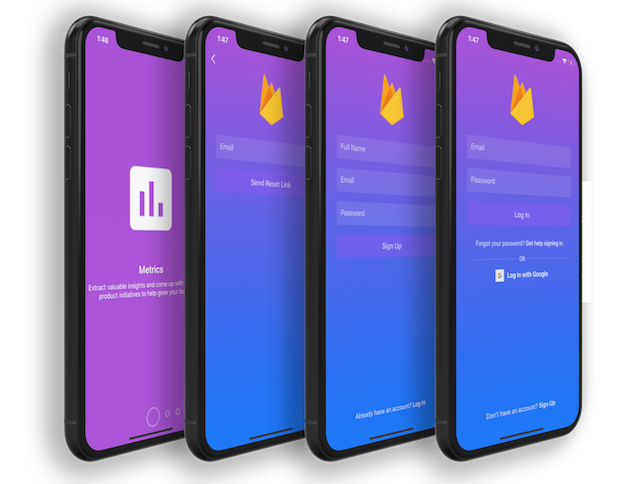

# Onboarding Tutorial (UIKit-Programmatic)

## Description

A beautiful onboarding and sign up feature with `Swift 5` using `Firebase` & `Firestore`.

You will see how to read data, how to insert data to `Realtime Database` and `Firestore`

> There is a branch for each!

Also if you want to look at the creation process, take a look at the **tags**.

